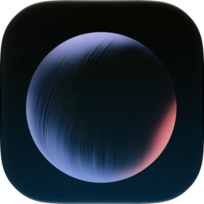
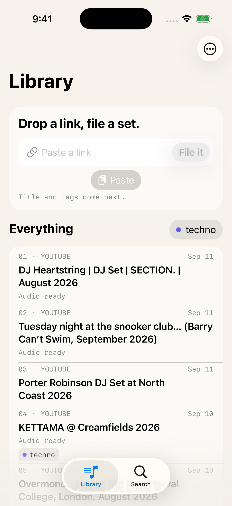

<p align="center">
  
</p>

<h1 align="center">Orbis</h1>

<p align="center">
  <a href="https://github.com/ParthMmm/orbis/actions/workflows/quality.yml"></a>
</p>

A private library for long music: DJ sets and mixes from YouTube and SoundCloud. Paste a link, file it with a title and tags, download the audio to a server you own, and play it from a native iPhone, iPad, or Mac app.

<p align="center">
  
</p>

Orbis is a personal project. It is built for one listener and one home server, and it makes firm choices to stay that way: no accounts, no public endpoint, no cloud. The source is public to read and to fork. It is not open source; see [License](#license).

## How it fits together

```text
 iPhone / iPad / Mac ─┐                        ┌─ SQLite library + audio files
 Raycast extension ───┼── Tailscale (HTTPS) ──▶ Bun + Effect API ──▶ Cobalt (audio fetch)
 Electron desktop ────┘   device token          └─ loopback only
```

- The server binds to loopback. A tailnet-only Tailscale Serve bridge is the only way in, and every request from off the machine needs an enrolled device token. The server stores only a digest of each token. See [ADR 0004](docs/adr/0004-native-service-identity.md).
- Saving a link creates a library entry. A separate Download step fetches audio and keeps it as Retained Audio beside the database. Native apps stream it with system media frameworks and seek by byte range.
- One Listening Queue and each Playback Position live on the server, so a second device resumes where the first stopped.

## What is in the repo

| Path | What it is |
| --- | --- |
| [`apps/server`](apps/server) | Bun and Effect v4 HTTP API, Bun SQLite storage, download worker, metadata providers |
| [`apps/apple/Orbis`](apps/apple/Orbis) | One SwiftUI app for iOS and macOS, with Now Playing, CarPlay, and a share extension. The Xcode project is generated with xcodegen |
| [`apps/apple/OrbisDesign`](apps/apple/OrbisDesign) | Swift package with the design tokens, styles, and components |
| [`apps/raycast`](apps/raycast) | Raycast commands: Save Current Tab and Save Clipboard |
| [`apps/desktop`](apps/desktop) | Electron, Vite, and React desktop client. The first client. The native apps are the focus now |
| [`packages/contracts`](packages/contracts) | Shared TypeScript API types |
| [`deploy`](deploy) | systemd unit and Tailscale Serve setup for the server, and the Cobalt Compose file |

## Choices worth a look

- **Domain language first.** [`CONTEXT.md`](CONTEXT.md) defines the terms (Set, Retained Audio, Playback Position, Listen) and the words to avoid. The code and the [decision records](docs/adr) use them.
- **Decision records.** Six [ADRs](docs/adr) cover the client platform, persisted download jobs, the audio fetch path, service identity, metadata providers, and artwork sizes.
- **One source for design tokens.** [`docs/design/tokens.json`](docs/design/tokens.json) generates the Swift colors and the CSS. CI fails if the output drifts.
- **Native test lanes.** `bun run native:lanes` starts a temporary server with its own database and trust store, pairs a device, and runs the unit tests and UI journeys against it. Every lane runs a strict swift-format check first.
- **Swift 6 strict concurrency**, on by default in the app target.
- **Written for agents too.** [`AGENTS.md`](AGENTS.md) and [`docs/agents`](docs/agents) record how coding agents work in this repo: issue tracker, triage labels, and how to verify UI on a real build.

## Status

Working today: saving and organizing Sets, tags, and Playlists; search and filters; audio Downloads; streaming playback with a shared Listening Queue and resume positions; Raycast capture. Planned work is tracked in [GitHub Issues](https://github.com/ParthMmm/orbis/issues).

Not built: shared libraries, collaborative Playlists, and a bundled server for the desktop app. Signing, notarization, and App Store release are not set up. The app is built and run from Xcode.

## Run it

You need Bun 1.4.1 and Node.js 24. The native app also needs Xcode 26.

```sh
bun install
bun run dev          # API on 127.0.0.1:4310 plus the desktop client
bun run check        # lint, format, types, tests, Effect diagnostics
```

Setup, server logging, the smoke test, and the native lanes are in [`docs/development.md`](docs/development.md). Routes are in [`docs/api.md`](docs/api.md). Deploying the server to a Linux host is in [`deploy/orbis-server`](deploy/orbis-server/README.md).

Downloads need a self-hosted [Cobalt](https://github.com/imputnet/cobalt) instance. See [`deploy/cobalt`](deploy/cobalt) and [`docs/research/cobalt-self-hosting.md`](docs/research/cobalt-self-hosting.md). Use it only for content you have the right to save.

## Contributing

I do not take pull requests or feature requests. Issues here are my own planning notes. Forks are welcome.

## License

Copyright (c) 2026 Parth Mangrola. All rights reserved. You can read the code and fork it on GitHub. You need written permission to reuse it. See [`LICENSE`](LICENSE).
